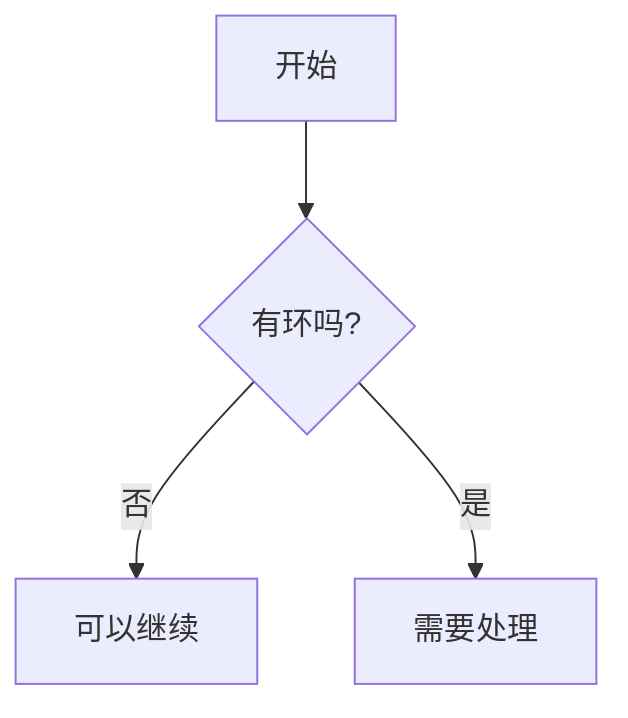

这篇更像一份给自己用的写作备忘。技术文章最容易出问题的地方，不是内容本身，而是排版一乱，信息就会明显变得难读。

## 标题层级

我会尽量控制标题层级不要太深。大多数文章里，`H2` 和 `H3` 已经够用了。

### 一个简单原则

- `H1` 只在页面标题里出现一次
- `H2` 用来区分核心段落
- `H3` 用来补充具体拆分

标题的作用不是“让页面热闹一点”，而是帮助读者知道接下来会看到什么。

## 列表和步骤

当我在写排查过程或者操作步骤时，会优先使用列表，因为它比长段落更适合快速扫读。

示例：

1. 先明确问题边界
2. 再建立最小验证路径
3. 最后记录结论和后续动作

如果只是平铺信息，也可以直接用无序列表：

- 输入条件
- 中间判断
- 最后结论

## 代码块和行内代码

行内代码适合放短小但关键的内容，比如命令、路径、配置项，例如 `npm run build`、`src/content/blog`。

多行示例则更适合独立代码块：

```ts
const summary = posts
  .slice(0, 3)
  .map((post) => post.data.title);
```

代码块最好只承担说明作用，不要把整篇文章写成长长的代码堆。

如果代码比较长，现在页面里会自动出现：

- 语言标签
- 复制代码按钮
- 长代码的展开和收起按钮

所以写作时只需要把代码块内容本身写清楚，不需要额外处理展示细节。

## Mermaid 图表

现在这套博客已经支持 Mermaid。

写法就是普通代码块，只是语言名写成 `mermaid`：



渲染后会直接显示成图表，同时保留：

- 查看源码
- 复制源码
- 跟随明暗主题切换重绘

我会更推荐在这些场景里用 Mermaid：

- 流程图
- 时序图
- 简单架构图
- 状态流转图

如果只是想快速把逻辑关系说清楚，Mermaid 的性价比很高。

## draw.io 怎么用更合适

`draw.io` 或 `diagrams.net` 也很适合画图，但在这个博客里，我更推荐它承担“复杂图”的角色，而不是直接渲染原始工程文件。

更稳的方式是：

1. 在 draw.io 里完成绘图
2. 导出成 `SVG`
3. 把导出的图作为普通图片插入文章

原因很简单：

- 原始 `.drawio` 文件不是浏览器原生显示格式
- 静态博客直接渲染它，链路会明显变复杂
- `SVG` 更轻、更清晰，也更适合技术图

所以我现在的建议是：

- 简单关系图，用 Mermaid
- 复杂结构图、部署图、精细排版图，用 draw.io 导出 `SVG`

如果导出的是 `.drawio.svg`，本质上也可以直接当图片使用。

## Mermaid 和 draw.io 怎么选

我一般会这么分：

- 想在正文里快速维护，优先 Mermaid
- 想要更自由的布局和视觉控制，优先 draw.io

换句话说：

- Mermaid 更像“可版本管理的图表代码”
- draw.io 更像“图形编辑器里的设计稿”

这两者不是互相替代，更像是分别适合不同复杂度的图。

## 引用和提示

引用块适合放“需要读者特别留意”的提醒，但我不会滥用它。

> 一篇技术文章真正重要的，是帮助读者建立判断，而不是塞进尽可能多的信息。

如果每一段都在强调重点，最后读者反而不知道重点到底在哪。

## 写完之后，我会再检查什么

文章写完以后，我通常会回头检查四件事：

- 标题是否能单独成立
- 摘要是否说明了这篇为什么值得读
- 段落之间有没有重复表达
- 代码和列表是不是都在帮助理解，而不是填版面
- 图表到底是在解释问题，还是只是在增加视觉元素

这份速查表本身没有多复杂，但它提醒我，写技术文章时，排版和表达其实是一件事。
